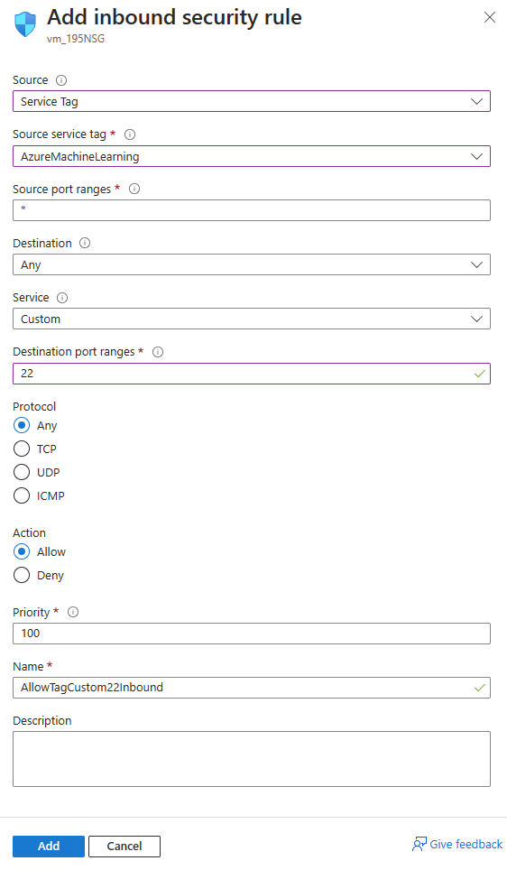
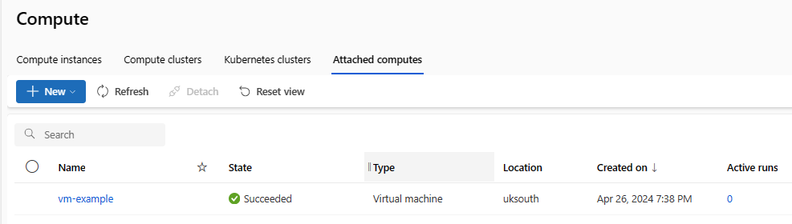
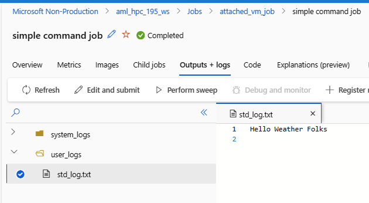

> run the following from repo root

### 1. Login
```bash
az login --tenant <tenant>
az account set -s <subscription>
```

### 2. Run setup infra script
Create a `.env` file at root level of the repo (gitignored) as per the sample provided. 

Then run the setup script.

```bash
bash infra/setup.sh
```
Verify the resources created in the Azure portal:
- Resource group
- Azure ML workspace and associated resources
- VM and associated resources

### 3. Networking
update the vm NSG to allow network access from Azure ML workspace

> (here, we're using the portal and configuring an allow rule for the Azure ML service tag, i.e. any ML workspace would be allowed to connect to this VM)


### 4. Attach the VM to Azure ML workspace
```bash
source .env
az ml compute attach -f definitions/compute/attached-vm.yml --resource-id $VM_ID --admin-password $VM_PASSWORD
```
This should result in a new compute visible through CLI:
```bash
az ml compute list -o table
```
```bash
-->
Name        Compute type    State
----------  --------------  ---------
vm-example  virtualmachine  Succeeded
```

or portal:




### 4a. (Optional) Create an Azure Compute Instance and cluster for comparison
```bash
az ml compute create -f definitions/compute/aml-compute-instance.yml
az ml compute create -f definitions/compute/aml-compute-cluster.yml
```


### 5. Submit a job
```bash
az ml job create -f definitions/job/simplejob/job.yml
```

:x: Currently seeing error without useful explanation: "UserError: Unable to establish SSH connection". Allowing access on all ports from anywhere on the NSG does not fix it. Perhaps try using ssh key instead of password for the VM.

:point_right: Expected outcome (obtained running on AML CI):

